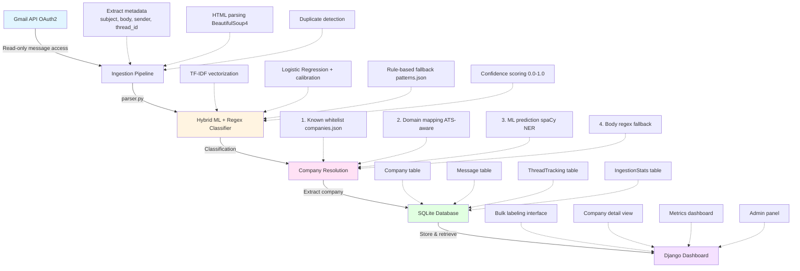

# 📧 GmailJobTracker

> **Privacy-first job application tracking powered by Gmail API + ML classification**

A local-only Django application that transforms your Gmail into an intelligent job hunt dashboard. Track applications, interviews, and rejections—all without your data leaving your machine.

[](https://www.python.org/downloads/)
[](https://www.djangoproject.com/)
[](LICENSE)
[](markdown/CONTRIBUTING.md)

**🚀 New Users:** Get started in 15 minutes → **[GETTING_STARTED.md](markdown/GETTING_STARTED.md)**

---

## ✨ Features

### 🎯 Smart Email Classification

- **Hybrid ML + Regex**: Combines TF-IDF/Logistic Regression with rule-based patterns
- **Auto-labeling**: 85%+ confidence messages auto-reviewed
- **6 Message Types**: job_application, interview_invite, rejection, head_hunter, noise, other
- **Confidence scoring**: See ML certainty for each classification

### 🏢 Company Resolution

- **4-tier fallback**: Known whitelist → domain mapping → ML prediction → body regex
- **ATS-aware**: Handles Greenhouse, Workday, Lever, and 10+ ATS platforms
- **Alias management**: Merge duplicate company names
- **Domain intelligence**: Maps recruiter domains to companies

### 📊 Dashboard & Analytics

- **Threaded view**: See entire conversation threads per company
- **Weekly/monthly stats**: Track rejection rates, interview funnel
- **Bulk labeling**: Label 10/50/100 messages at once with checkboxes
- **Confidence filtering**: Focus on low-confidence predictions
- **Calendar view**: Upcoming interviews timeline

### 🔒 Privacy & Security

- **100% local**: All data stored in SQLite, no cloud sync
- **OAuth-only**: Read-only Gmail access, revocable anytime
- **Secret scanning**: detect-secrets baseline enforced in CI
- **No tracking**: Zero telemetry, analytics, or external API calls

---

## 🚀 Quick Start

### New Users: Start Here!

**📘 Complete Setup Guide:** See **[GETTING_STARTED.md](markdown/GETTING_STARTED.md)** for step-by-step instructions (15-20 minutes)

### Experienced Users: Express Install

```bash
# 1. Clone repository
git clone https://github.com/cyberthreatgurl/GmailJobTracker.git
cd GmailJobTracker

# 2. Setup virtual environment
python -m venv venv
source venv/bin/activate  # Windows: venv\Scripts\activate

# 3. Install dependencies
pip install -r requirements.txt
python -m spacy download en_core_web_sm

# 4. Configure environment
cp .env.example .env
# Edit .env: Set GMAIL_ROOT_FILTER_LABEL and USER_EMAIL_ADDRESS

# 5. Setup Gmail API (see GETTING_STARTED.md section 2)
# Place credentials.json in json/ directory

# 6. Create User Account
python manage.py createsuperuser

# 7. Initialize database
python manage.py migrate

# 8. Authenticate with Gmail
python gmail_auth.py

# 9. Ingest recent emails
python manage.py ingest_gmail --days-back 7

# 10. Start server
python manage.py runserver
```

**Visit:** <http://127.0.0.1:8000/>

### Documentation

- **📘 [GETTING_STARTED.md](markdown/GETTING_STARTED.md)** - Complete beginner's guide
- **📖 [INSTALL.md](markdown/INSTALL.md)** - Advanced installation options
- **🐳 [DOCKER_README.md](markdown/DOCKER_README.md)** - Docker deployment guide
- **🔧 [CONTRIBUTING.md](markdown/CONTRIBUTING.md)** - Development guidelines

---

## 📸 Screenshots

### Dashboard Overview

![Dashboard] (images/Dashboard.png)

### Dashboard with Date Filter

![Dashboard with Date Filter] (images/dash_filter.png)

### Bulk Labeling Interface

![Bulk Message Labeling] (images/label_messages.png)

### Company Detail View

## Coming soon: Screenshot of threaded messages per company*

### CLI View

![Starting up the web interface] (/images/cli.png)


---

## 🏗️ Architecture



**Data Flow:**

1. Gmail API → Extract metadata
2. Parse subject/body → ML classification
3. Company resolution (4-tier)
4. Store in SQLite → Update stats
5. Display in Django dashboard

**Key Technologies:**

- **Backend:** Django 5.2, scikit-learn 1.7, spaCy 3.8
- **ML:** TF-IDF + Logistic Regression (calibrated probabilities)
- **Database:** SQLite (single file, no server)
- **OAuth:** google-auth-oauthlib (read-only scope)

---

## 🎓 Usage

### Initial Training (First Time)

1. **Ingest last 7 days:**

   ```bash
   python manage.py ingest_gmail --days-back 7
   ```

2. **Label 50-100 messages:**
   - Visit: <http://127.0.0.1:8000/tracker/label_messages/>
   - Select messages with checkboxes
   - Choose correct label from dropdown
   - Click "Apply Label to Selected"

3. **Model retrains automatically** after every 20 labels

4. **Re-classify existing messages:**

   ```bash
   python manage.py reclassify_messages
   ```

### Daily Sync

**Manual:**

```bash
python manage.py ingest_gmail --days-back 1
```

**Automated (Windows Task Scheduler):**

```powershell
schtasks /create /tn "GmailJobTracker" /tr "C:\path\to\.venv\Scripts\python.exe C:\path\to\manage.py ingest_gmail --days-back 1" /sc daily /st 09:00
```

**Automated (Linux/macOS cron):**

```bash
0 9 * * * cd /path/to/GmailJobTracker && .venv/bin/python manage.py ingest_gmail --days-back 1
```

### Company Management

**Add domain mappings:**

```json
// json/companies.json
{
  "domain_to_company": {
    "greenhouse.io": "Greenhouse",
    "myworkdayjobs.com": "Workday"
  }
}
```

**Re-ingest with new mappings:**

```bash
python manage.py ingest_gmail --force --days-back 30
```

### View Unresolved Companies

Visit: <http://127.0.0.1:8000/admin/tracker/unresolvedcompany/>

Manually assign companies to messages where resolution failed.

---

## 📚 Documentation

- **[INSTALL.md](markdown/INSTALL.md)** - Detailed setup instructions
- **[CONTRIBUTING.md](markdown/CONTRIBUTING.md)** - Contribution guidelines
- **[markdown/EXTRACTION_LOGIC.md](markdown/EXTRACTION_LOGIC.md)** - Company/job parsing details
- **[markdown/LABEL_MESSAGES_BULK.md](markdown/LABEL_MESSAGES_BULK.md)** - Bulk labeling guide
- **[markdown/SECURITY.md](markdown/SECURITY.md)** - Security practices
- **[markdown/BACKLOG.md](markdown/BACKLOG.md)** - Planned features

---

## 🌐 Public companies.json dataset

This project maintains a public, version-controlled mapping of companies, domains, aliases, and ATS/headhunter domains used for company resolution:

- File: `json/companies.json`
- Schema: `json/companies.schema.json`
- CI validation: `.github/workflows/validate-companies.yml`

Contributions welcome! If you want to add or correct entries:

1. Edit `json/companies.json` (keep entries alphabetized where possible)
2. Validate locally:

   ```powershell
   # Windows PowerShell
   python -m scripts.validate_companies
   ```

   ```bash
   # Linux/macOS
   python -m scripts.validate_companies
   ```

3. Open a PR – CI will run the same validation.

Fields in `companies.json`:

- `known`: Canonical company names (array of strings)
- `domain_to_company`: Map of email/web domains → company name
- `aliases`: Common display names/sender prefixes → company name
- `ats_domains`: Applicant Tracking System domains (used for ATS-aware parsing)
- `headhunter_domains`: Recruiter/agency domains (auto-mapped to HeadHunter)
- `JobSites`: Company → careers URL (optional; used in UI)

Notes:

- Please avoid adding personal or private domains. Only add public employer or ATS/recruiter domains.
- Typos and casing matter for matching – use exact, properly cased company names.
- If you aren't sure whether a value belongs in `aliases` vs `domain_to_company`, open a PR and we can review.

---

## 🧪 Testing

```bash
# Run all tests
pytest

# With coverage
pytest --cov=tracker --cov-report=html

# Specific test module
pytest tests/test_ingest_message.py

# Environment checks
python check_env.py
```

---

## 🧹 Start With a Fresh Database (keep models)

If you want to wipe all data and start clean while keeping your Django models, migrations, and ML artifacts, reset the SQLite database file.

Notes:

- The database path is controlled by the environment variable `JOB_TRACKER_DB`; if not set, it defaults to `db/job_tracker.db` (see `db.py` and `dashboard/settings.py`).
- Close any running server or ingestion before deleting (to avoid “database is locked”).
- Model artifacts under `model/` are not affected.

### Option A — Delete the SQLite file (recommended)

Windows PowerShell:

```powershell
# Stop the server/ingestion if running
# Remove the DB file (default path)
Remove-Item -LiteralPath "db/job_tracker.db" -Force -ErrorAction SilentlyContinue

# If you customized the location via env var
if ($env:JOB_TRACKER_DB) { Remove-Item -LiteralPath $env:JOB_TRACKER_DB -Force -ErrorAction SilentlyContinue }

# Recreate the schema
python manage.py migrate

# (Optional) Recreate an admin account
python manage.py createsuperuser

# (Optional) Re-ingest some recent emails
python manage.py ingest_gmail --days-back 7
```

Linux/macOS bash:

```bash
# Stop the server/ingestion if running
# Remove the DB file (default path)
rm -f db/job_tracker.db

# If you customized the location via env var
[ -n "$JOB_TRACKER_DB" ] && rm -f "$JOB_TRACKER_DB"

# Recreate the schema
python manage.py migrate

# (Optional) Recreate an admin account
python manage.py createsuperuser

# (Optional) Re-ingest some recent emails
python manage.py ingest_gmail --days-back 7
```

### Option B — Flush data in-place (keeps the file)

If you prefer to keep the same SQLite file but empty all tables:

```bash
python manage.py flush --noinput
python manage.py createsuperuser  # users are removed by flush
```

Tip: If you see “database is locked”, ensure no other process is using the DB and try again.

---

## 🛠️ Development

### Project Structure

GmailJobTracker/
├── tracker/                 # Django app
│   ├── models.py            # Company, Application, Message models
│   ├── views.py             # Dashboard views (label_messages, metrics)
│   ├── admin.py             # Admin customizations
│   └── management/commands/ # Django commands (ingest_gmail, reclassify)
├── parser.py                # Core email parsing + company resolution
├── ml_subject_classifier.py # ML prediction wrapper
├── ml_entity_extraction.py  # spaCy entity extraction
├── train_model.py           # Model training script
├── db_helpers.py            # Database utilities
├── json/                    # Configuration files
│   ├── patterns.json        # Regex patterns for classification
│   └── companies.json       # Company whitelist + domain mappings
└── model/                   # ML artifacts (gitignored)
    ├── message_classifier.pkl
    ├── subject_vectorizer.pkl
    └── body_vectorizer.pkl

### Adding Features

1. Fork the repo
2. Create feature branch: `git checkout -b feature/name`
3. Make changes + add tests
4. Run tests: `pytest`
5. Submit PR

See [CONTRIBUTING.md](markdown/CONTRIBUTING.md) for detailed guidelines.

---

## 🤝 Contributing

Contributions welcome! See [CONTRIBUTING.md](markdown/CONTRIBUTING.md) for:

- Code style guidelines
- Testing requirements
- PR submission process
- Development tips

---

## 📄 License

This project is licensed under the MIT License - see [LICENSE](LICENSE) file for details.

---

## 🙏 Acknowledgments

- **spaCy** for NER models
- **scikit-learn** for ML infrastructure
- **Django** for web framework
- **Google Gmail API** for email access

---

## 🐛 Known Issues

- **Low accuracy on rare classes:** Rejection class needs more training data (currently 13 samples)
- **ATS domain resolution:** Some ATS domains (Lever, Ashby) not yet mapped
- **Memory usage:** Large ingestions (1000+ messages) may require batching

See [Issues](https://github.com/<your-username>/GmailJobTracker/issues) for full list.

---

## 🗺️ Roadmap

- [ ] Export to CSV/Excel
- [ ] Calendar integration (add interviews to Google Calendar)
- [ ] Email templates for follow-ups
- [ ] Salary range extraction from job posts
- [ ] Chrome extension for quick labeling
- [ ] Mobile-responsive dashboard

See [markdown/BACKLOG.md](markdown/BACKLOG.md) for detailed roadmap.

---

## ⚠️ Privacy Notice

**All data stays local.** This application:

- ✅ Stores everything in SQLite (single file)
- ✅ Uses OAuth with read-only Gmail scope
- ✅ Never sends data to external servers
- ✅ Never tracks usage or analytics
- ❌ Does NOT sync to cloud
- ❌ Does NOT require internet (except Gmail API)

**To revoke access:** <https://myaccount.google.com/permissions>

---

## � Dependency Management

The project uses **pip-tools** for dependency management:

- **`requirements-prod.in`** - Direct production dependencies only
- **`requirements.txt`** - Compiled production requirements (auto-generated)
- **`requirements-dev.in`** - Development/testing tools
- **`requirements-dev.txt`** - Compiled dev requirements (auto-generated)

**To update dependencies:**

```bash
pip install pip-tools
pip-compile requirements-prod.in -o requirements.txt
pip-compile requirements-dev.in -o requirements-dev.txt
```

This approach:

- ✅ Keeps Docker images smaller (no dev tools in production)
- ✅ Pins all transitive dependencies for reproducibility
- ✅ Makes it clear which packages you directly depend on

---

## �📧 Support

- **Issues:** [GitHub Issues](https://github.com/<your-username>/GmailJobTracker/issues)
- **Discussions:** [GitHub Discussions](https://github.com/<your-username>/GmailJobTracker/discussions)
- **Email:** <your-email@example.com>

---

Made with ❤️ by privacy-conscious job seekers
