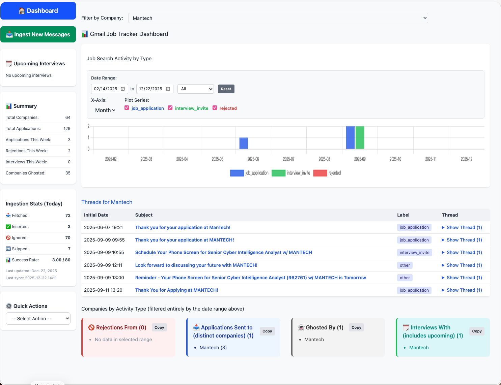
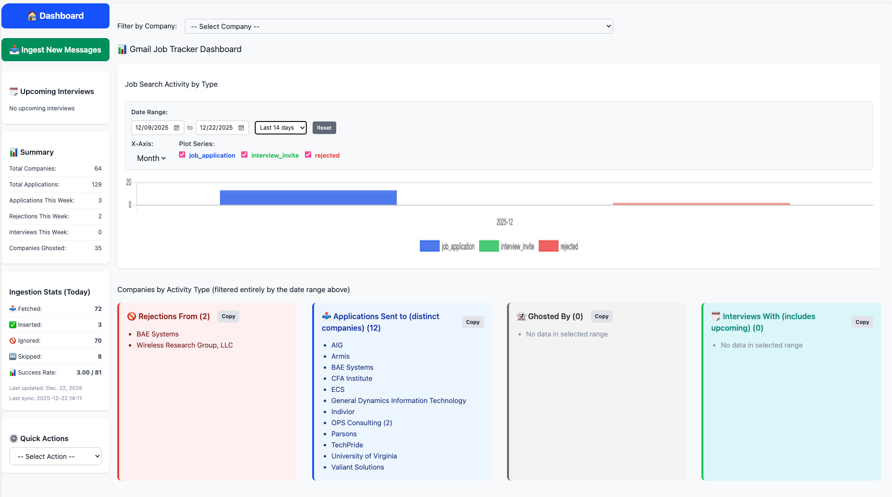
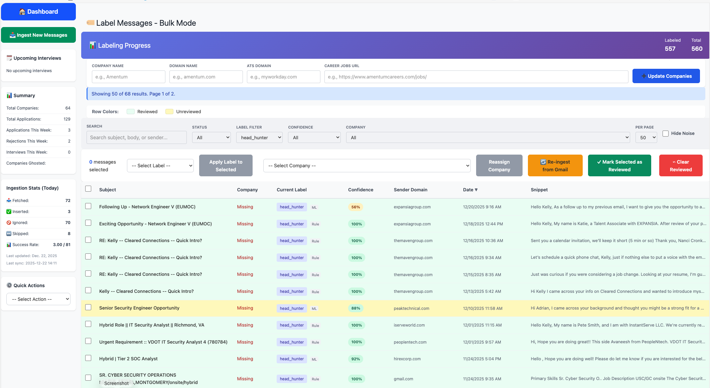
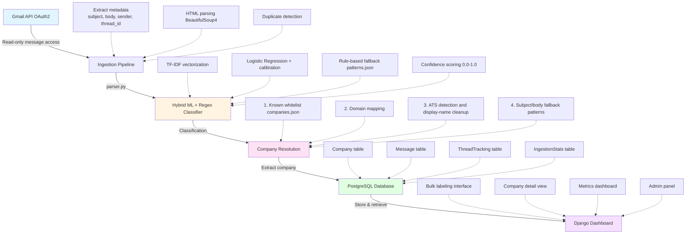

# 📧 GmailJobTracker

> **Privacy-first job application tracking powered by Gmail API + ML classification**

A local-only Django application that transforms your Gmail into an intelligent job hunt dashboard. Track applications, interviews, and rejections—all without your data leaving your machine.

[](https://www.python.org/downloads/)
[](https://www.djangoproject.com/)
[](LICENSE)
[](markdown/CONTRIBUTING.md)

**🚀 New Users:** Get started in 15 minutes → **[GETTING_STARTED.md](markdown/GETTING_STARTED.md)**

---

## ✨ Features

### 🎯 Smart Email Classification

- **Hybrid ML + Regex**: Combines TF-IDF/Logistic Regression with rule-based patterns
- **Auto-labeling**: 85%+ confidence messages auto-reviewed
- **6 Message Types**: job_application, interview_invite, rejection, head_hunter, noise, other
- **Confidence scoring**: See ML certainty for each classification

### 🏢 Company Resolution

- **4-tier fallback**: Known whitelist → domain mapping → ML prediction → body regex
- **ATS-aware**: Handles Greenhouse, Workday, Lever, and 10+ ATS platforms
- **Config-backed canonicalization**: Matches against `known`, `domain_to_company`, `JobSites`, and `aliases`
- **Alias management**: Merge duplicate company names
- **Domain intelligence**: Maps recruiter domains to companies

### 📊 Dashboard & Analytics

- **Threaded view**: See entire conversation threads per company
- **Weekly/monthly stats**: Track rejection rates, interview funnel
- **Deduplicated application metrics**: Dashboard and sidebar counts now track canonical application records instead of counting every acknowledgement email
- **Bulk labeling**: Label 10/50/100 messages at once with checkboxes
- **Confidence filtering**: Focus on low-confidence predictions
- **Calendar view**: Upcoming interviews timeline
- **Label Companies workspace**: Refresh contracts in place, preview homepage-derived domains, and keep stored domains synchronized from saved homepages
- **🔍 Job Search Tracker**: Proactively track which companies you've manually searched for opportunities

### 🏛️ Defense Contract Awards

- **War.gov scraper**: Automated scraping of daily defense contract announcements
- **Contract parsing**: Extracts company, amount, location, branch, contract number from each award
- **Searchable dashboard**: Filter by branch, keyword, date range with summary statistics
- **Company linking**: Auto-matches contract awardees to tracked companies
- **Article caching**: Prevents redundant HTTP requests with ScrapedArticle tracking
- **Playwright-powered**: Bypasses Akamai WAF using headed Chromium browser

### 🔒 Privacy & Security

- **100% local**: Data stays in your own PostgreSQL instance for local development and deployment
- **OAuth-only**: Read-only Gmail access, revocable anytime
- **Secret scanning**: detect-secrets baseline enforced in CI
- **No tracking**: Zero telemetry, analytics, or external API calls

---

## 🚀 Quick Start

### New Users: Start Here!

**📘 Complete Setup Guide:** See **[GETTING_STARTED.md](markdown/GETTING_STARTED.md)** for step-by-step instructions (15-20 minutes)

### Experienced Users: Express Install

```bash
# 1. Clone repository
git clone https://github.com/cyberthreatgurl/GmailJobTracker.git
cd GmailJobTracker

# 2. Setup virtual environment
python -m venv venv
source venv/bin/activate  # Windows: venv\Scripts\activate

# 3. Install dependencies
pip install -r requirements.txt
python -m spacy download en_core_web_sm

# 4. Configure environment
cp .env.example .env
# Edit .env: Set GMAIL_ROOT_FILTER_LABEL, USER_EMAIL_ADDRESS, and PostgreSQL connection values

# 5. Setup Gmail API (see GETTING_STARTED.md section 2)
# Place credentials.json in json/ directory

# 6. Create User Account
python manage.py createsuperuser

# 7. Initialize database
python manage.py migrate

# 8. Authenticate with Gmail
python gmail_auth.py

# 9. Ingest recent emails
python manage.py ingest_gmail --days-back 7

# 10. Start server
python manage.py runserver
```

If the configured default database is unreachable at startup, the server now stops immediately with a clean error instead of continuing in a broken state.

The application now uses PostgreSQL across local development, CI, and Docker so the same database stack is exercised everywhere.

**Visit:** <http://127.0.0.1:8000/>

### Documentation

- **📘 [GETTING_STARTED.md](markdown/GETTING_STARTED.md)** - Complete beginner's guide
- **📖 [INSTALL.md](markdown/INSTALL.md)** - Advanced installation options
- **🐳 [DOCKER_README.md](markdown/DOCKER_README.md)** - Docker deployment guide
- **🔧 [CONTRIBUTING.md](markdown/CONTRIBUTING.md)** - Development guidelines

---

## 📸 Screenshots

### Dashboard Overview



### Dashboard with Date Filter



### Bulk Labeling Interface



### Company Detail View

## Coming soon: Screenshot of threaded messages per company*

### CLI View


---

## 🏗️ Architecture


```mermaid
graph TD
    A[Gmail API OAuth2] -->|Read-only message access| B[Ingestion Pipeline]
    B -->|parser.py| C[Hybrid ML + Regex Classifier]
    C -->|Classification| D[Company Resolution]
   D -->|Extract company| E[PostgreSQL Database]
    E -->|Store & retrieve| F[Django Dashboard]
    
    B1[Extract metadata<br/>subject, body, sender, thread_id] -.-> B
    B2[HTML parsing BeautifulSoup4] -.-> B
    B3[Duplicate detection] -.-> B
    
    C1[TF-IDF vectorization] -.-> C
    C2[Logistic Regression + calibration] -.-> C
    C3[Rule-based fallback patterns.json] -.-> C
    C4[Confidence scoring 0.0-1.0] -.-> C
    
   D1[1. Known whitelist companies.json] -.-> D
   D2[2. Domain mapping] -.-> D
   D3[3. ATS detection and display-name cleanup] -.-> D
   D4[4. Subject/body fallback patterns] -.-> D
    
    E1[Company table] -.-> E
    E2[Message table] -.-> E
    E3[ThreadTracking table] -.-> E
    E4[IngestionStats table] -.-> E
    
    F1[Bulk labeling interface] -.-> F
    F2[Company detail view] -.-> F
    F3[Metrics dashboard] -.-> F
    F4[Admin panel] -.-> F
    
    style A fill:#e1f5ff
    style C fill:#fff4e1
    style D fill:#ffe1f5
    style E fill:#e1ffe1
    style F fill:#f5e1ff
```

**Data Flow:**

1. Gmail API → Extract metadata
2. Parse subject/body → ML classification
3. Company resolution (4-tier)
4. Store in local database → Update stats
5. Display in Django dashboard

**Key Technologies:**

- **Backend:** Django 5.2, scikit-learn 1.7, spaCy 3.8
- **ML:** TF-IDF + Logistic Regression (calibrated probabilities)
- **Database:** PostgreSQL for local development, CI, and deployment
- **OAuth:** google-auth-oauthlib (read-only scope)
- **Scraping:** Playwright (headed Chromium for war.gov WAF bypass)

---

## 🎓 Usage

### Initial Training (First Time)

1. **Ingest last 7 days:**

   ```bash
   python manage.py ingest_gmail --days-back 7
   ```

2. **Label 50-100 messages:**
   - Visit: <http://127.0.0.1:8000/tracker/label_messages/>
   - Select messages with checkboxes
   - Choose correct label from dropdown
   - Click "Apply Label to Selected"

3. **Model retrains automatically** after every 20 labels

4. **Re-classify existing messages:**

   ```bash
   python manage.py reclassify_messages
   ```

### Daily Sync

**Manual:**

```bash
python manage.py ingest_gmail --days-back 1
```

**Automated (Windows Task Scheduler):**

```powershell
schtasks /create /tn "GmailJobTracker" /tr "C:\path\to\.venv\Scripts\python.exe C:\path\to\manage.py ingest_gmail --days-back 1" /sc daily /st 09:00
```

**Automated (Linux/macOS cron):**

```bash
0 9 * * * cd /path/to/GmailJobTracker && .venv/bin/python manage.py ingest_gmail --days-back 1
```

### Company Management

**Add domain mappings:**

```json
// json/companies.json
{
  "domain_to_company": {
      "acme.com": "Acme Corporation",
      "jobs.exampledefense.com": "Example Defense"
  }
}
```

Use `domain_to_company` for real company domains. Shared ATS platforms such as Jobvite, Greenhouse, and Workday should stay in ATS heuristics or `ats_domains` unless the domain is company-specific.

For existing companies on `/label_companies/`, the saved homepage URL is shown read-only, the preview panel derives the homepage domain automatically, and saving the company keeps the stored `domain` field synchronized with that derived value.

**Re-ingest with new mappings:**

```bash
python manage.py ingest_gmail --force --days-back 30
```

### View Unresolved Companies

Visit: <http://127.0.0.1:8000/admin/tracker/unresolvedcompany/>

Manually assign companies to messages where resolution failed.

---

## 📚 Documentation

- **[INSTALL.md](markdown/INSTALL.md)** - Detailed setup instructions
- **[CONTRIBUTING.md](markdown/CONTRIBUTING.md)** - Contribution guidelines
- **[markdown/EXTRACTION_LOGIC.md](markdown/EXTRACTION_LOGIC.md)** - Company/job parsing details
- **[markdown/LABEL_MESSAGES_BULK.md](markdown/LABEL_MESSAGES_BULK.md)** - Bulk labeling guide
- **[markdown/SECURITY.md](markdown/SECURITY.md)** - Security practices
- **[markdown/BACKLOG.md](markdown/BACKLOG.md)** - Planned features

---

## 🌐 Public companies.json dataset

This project maintains a public, version-controlled mapping of companies, domains, aliases, and ATS/headhunter domains used for company resolution:

- File: `json/companies.json`
- Schema: `json/companies.schema.json`
- CI validation: `.github/workflows/validate-companies.yml`

Contributions welcome! If you want to add or correct entries:

1. Edit `json/companies.json` (keep entries alphabetized where possible)
2. Validate locally:

   ```powershell
   # Windows PowerShell
   python -m scripts.validate_companies
   ```

   ```bash
   # Linux/macOS
   python -m scripts.validate_companies
   ```

3. Open a PR – CI will run the same validation.

Fields in `companies.json`:

- `known`: Canonical company names (array of strings)
- `domain_to_company`: Map of email/web domains → company name
- `aliases`: Common display names/sender prefixes → company name
- `ats_domains`: Applicant Tracking System domains (used for ATS-aware parsing)
- `headhunter_domains`: Recruiter/agency domains (auto-mapped to HeadHunter)
- `JobSites`: Company → careers URL (optional; used in UI)

Notes:

- Please avoid adding personal or private domains. Only add public employer or ATS/recruiter domains.
- Typos and casing matter for matching – use exact, properly cased company names.
- If you aren't sure whether a value belongs in `aliases` vs `domain_to_company`, open a PR and we can review.

Recommended order when adding a new company:

1. Pick the canonical company name and use that exact casing everywhere.
2. Add the real company domain to `domain_to_company`.
3. Add the careers URL to `JobSites`.
4. Add common abbreviations and display-name variants to `aliases`.
5. Add the canonical company name to `known`.
6. Only add `ats_domains` if the sender domain is a shared ATS platform not already covered by `ats_heuristic_patterns`.

Parsing reliability notes:

- `domain_to_company` is the highest-value manual entry for direct company resolution.
- `aliases` help when recruiter display names, ATS sender prefixes, or subject lines use a shortened or variant name.
- `known` improves subject matching and display-name validation.
- Do not put shared ATS platform domains in `domain_to_company` unless they truly belong to a single company.
- If a homepage/careers URL exists, prefer keeping `JobSites`, `domain_to_company`, `aliases`, and `known` aligned to the same canonical name.

Recent parser improvements:

- Forwarded `.eml` imports now prefer the inner forwarded message headers for the original sender, recipient, subject, and sent date.
- Duplicate acknowledgement emails for the same job now enrich the existing application record instead of inflating application counts.
- Prescreen, interview, and offer milestones now try to attach to the correct existing application rather than creating an orphan record when the Gmail thread changes.

---

## 🧪 Testing

```bash
# Run all tests
pytest

# With coverage
pytest --cov=tracker --cov-report=html

# Specific test module
pytest tests/test_ingest_message.py

# Environment checks
python check_env.py
```

---

## 🧹 Start With a Fresh Database (keep models)

If you want to wipe all data and start clean while keeping your Django models, migrations, and ML artifacts, reset the PostgreSQL database.

Notes:

- The application now uses PostgreSQL only. Reset the PostgreSQL database instead of deleting or restoring a separate file-based database.
- Close any running server or ingestion before resetting the schema.
- Model artifacts under `model/` are not affected.

### Option A — Reset the PostgreSQL database (recommended)

Windows PowerShell:

```powershell
# Stop the server/ingestion if running
# Drop and recreate the public schema
psql -h localhost -U "$env:DB_USERNAME" -d "$env:DB_NAME" -c "DROP SCHEMA public CASCADE; CREATE SCHEMA public;"

# Recreate the schema
python manage.py migrate

# (Optional) Recreate an admin account
python manage.py createsuperuser

# (Optional) Re-ingest some recent emails
python manage.py ingest_gmail --days-back 7
```

Linux/macOS bash:

```bash
# Stop the server/ingestion if running
# Drop and recreate the public schema
PGPASSWORD="$DB_PASSWORD" psql -h "$DB_HOST" -U "$DB_USERNAME" -d "$DB_NAME" -c "DROP SCHEMA public CASCADE; CREATE SCHEMA public;"

# Recreate the schema
python manage.py migrate

# (Optional) Recreate an admin account
python manage.py createsuperuser

# (Optional) Re-ingest some recent emails
python manage.py ingest_gmail --days-back 7
```

### Option B — Flush data in-place (keeps the file)

If you prefer to keep the same PostgreSQL database but empty all tables:

```bash
python manage.py flush --noinput
python manage.py createsuperuser  # users are removed by flush
```

Tip: If you see “database is locked”, ensure no other process is using the DB and try again.

---

## 🛠️ Development

### Project Structure

GmailJobTracker/
├── tracker/                 # Django app
│   ├── models.py            # Company, Message, DefenseContract, ScrapedArticle models
│   ├── views/               # Dashboard views split by domain
│   ├── services/            # Business logic (contract_scraper, company_service, etc.)
│   ├── admin.py             # Admin customizations
│   └── management/commands/ # Django commands (ingest_gmail, fetch_contracts, etc.)
├── parser.py                # Core email parsing + company resolution
├── ml_subject_classifier.py # ML prediction wrapper
├── ml_entity_extraction.py  # spaCy entity extraction
├── train_model.py           # Model training script
├── db_helpers.py            # Database utilities
├── json/                    # Configuration files
│   ├── patterns.json        # Regex patterns for classification
│   └── companies.json       # Company whitelist + domain mappings
└── model/                   # ML artifacts (gitignored)
    ├── message_classifier.pkl
    ├── subject_vectorizer.pkl
    └── body_vectorizer.pkl

### Adding Features

1. Fork the repo
2. Create feature branch: `git checkout -b feature/name`
3. Make changes + add tests
4. Run tests: `pytest`
5. Submit PR

See [CONTRIBUTING.md](markdown/CONTRIBUTING.md) for detailed guidelines.

---

## 🤝 Contributing

Contributions welcome! See [CONTRIBUTING.md](markdown/CONTRIBUTING.md) for:

- Code style guidelines
- Testing requirements
- PR submission process
- Development tips

---

## 📄 License

This project is licensed under the MIT License - see [LICENSE](LICENSE) file for details.

---

## 🙏 Acknowledgments

- **spaCy** for NER models
- **scikit-learn** for ML infrastructure
- **Django** for web framework
- **Google Gmail API** for email access

---

## 🐛 Known Issues

- **Low accuracy on rare classes:** Rejection class needs more training data (currently 13 samples)
- **ATS domain resolution:** Some ATS domains (Lever, Ashby) not yet mapped
- **Memory usage:** Large ingestions (1000+ messages) may require batching

See [Issues](https://github.com/<your-username>/GmailJobTracker/issues) for full list.

---

## 🗺️ Roadmap

- [ ] Export to CSV/Excel
- [ ] Calendar integration (add interviews to Google Calendar)
- [ ] Email templates for follow-ups
- [ ] Salary range extraction from job posts
- [ ] Chrome extension for quick labeling
- [ ] Mobile-responsive dashboard

See [markdown/BACKLOG.md](markdown/BACKLOG.md) for detailed roadmap.

---

## ⚠️ Privacy Notice

**All data stays local.** This application:

- ✅ Stores data in your own PostgreSQL instance only
- ✅ Uses OAuth with read-only Gmail scope
- ✅ Never sends data to external servers
- ✅ Never tracks usage or analytics
- ❌ Does NOT sync to cloud
- ❌ Does NOT require internet (except Gmail API)

**To revoke access:** <https://myaccount.google.com/permissions>

---

## � Dependency Management

The project uses **pip-tools** for dependency management:

- **`requirements-prod.in`** - Direct production dependencies only
- **`requirements.txt`** - Compiled production requirements (auto-generated)
- **`requirements-dev.in`** - Development/testing tools
- **`requirements-dev.txt`** - Compiled dev requirements (auto-generated)

**To update dependencies:**

```bash
pip install pip-tools
pip-compile requirements-prod.in -o requirements.txt
pip-compile requirements-dev.in -o requirements-dev.txt
```

This approach:

- ✅ Keeps Docker images smaller (no dev tools in production)
- ✅ Pins all transitive dependencies for reproducibility
- ✅ Makes it clear which packages you directly depend on

---

## �📧 Support

- **Issues:** [GitHub Issues](https://github.com/<your-username>/GmailJobTracker/issues)
- **Discussions:** [GitHub Discussions](https://github.com/<your-username>/GmailJobTracker/discussions)
- **Email:** <your-email@example.com>

---

Made with ❤️ by privacy-conscious job seekers
